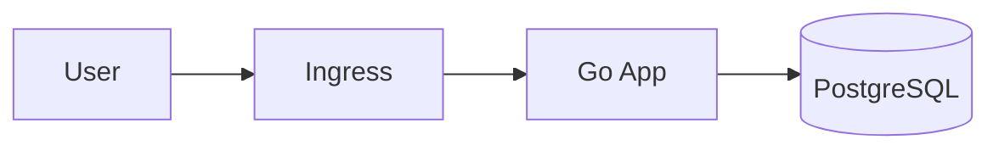

# Go App Kubernetes

This project is a simple Go application designed to be easily deployed either locally, with Docker, or to a Kubernetes (K8s) cluster.

## Diagram



## Features

- Written in Go
- Containerized using Docker
- Supports Minikube for Kubernetes local development

## Getting Started

### Prerequisites

- [Go](https://golang.org/dl/) installed
- [Docker](https://www.docker.com/get-started/) installed
- [Minikube](https://minikube.sigs.k8s.io/docs/) installed (for Kubernetes testing)

### Running the Project Locally

1. **Clone the repository**
    ```sh
    git clone <your-repo-url>
    cd <your-project-directory>
    ```

2. **Build and run with Go**
    ```sh
    go build -o go-app
    ./go-app
    ```

    The application will be accessible at `http://localhost:8080` (or the port configured in the app).

### Running with Docker

1. **Build the Docker image**
    ```sh
    docker build -t go-app:latest .
    ```

2. **Run the container**
    ```sh
    docker run -p 8080:8080 go-app:latest
    ```

    Visit `http://localhost:8080` to see your app running in Docker.

### Running in Kubernetes with Minikube

1. **Build the Docker image and load it into Minikube**
    ```sh
    docker build -t go-app:latest .
    minikube image load go-app:latest
    ```

2. **Deploy to your Minikube cluster using your Kubernetes manifest**
    ```sh
    kubectl apply -f k8s/deployment.yaml
    ```

3. **Access your service**
    
    If using a `NodePort`, run:
    ```sh
    minikube service go-app
    ```

## Troubleshooting

- Make sure Docker and Minikube are running.
- Ensure ports are not in use before starting the application.
- If you update the source, rebuild and reload the Docker image for Minikube.

## License

[MIT](LICENSE)
